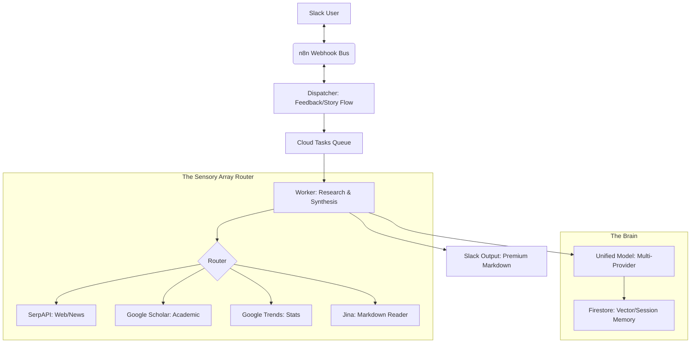

# 'Sonnet & Prose' — The Autonomous Content Strategist 🎭🌐

**Sonnet & Prose** is a production-grade, multi-agent AI system designed for **Answer Engine Optimization (AEO)** and strategic content synthesis. It transforms simple user inquiries into rich, data-grounded narratives, research reports, and deep-dive articles.

Built as a capstone for the *Google AI Agents Intensive*, it represents the cutting edge of autonomous research and conversational synthesis.

---

## 🚀 1. The Strategy: From "SEO" to "AEO"
In a world of Answer Engines (Perplexity, SearchGPT, Gemini), standard SEO isn't enough. **Sonnet & Prose** is built to win the "Zero-Click" SERP. It doesn't just write; it architecturally designs content to satisfy both human curiosity and AI grounding requirements.

### The Value Loop
1.  **Conversational Triage (Hearing Restoration)**: Distinguishes between casual banter, discovery research, and recursive drafting by analyzing raw user intent in context.
2.  **Autonomous Research**: Operates an intent-driven "Sensory Array Router" to select specialized tools (Web, Scholar, Trends, Analysis) based on discovery vs. composition needs.
3.  **Recursive Deep-Dive Engine**: Architecturally generates long-form content (e.g., 800+ words) through a multi-room "blueprint" approach to ensure depth and coherence.
4.  **Long-Term Memory (Hippocampus)**: Ingests every interaction into a vectorized knowledge base (Firestore RAG) to ensure the agent maintains cross-thread continuity.

---

## 🏗️ 2. High-Level Architecture
The system is an event-driven microservice architecture deployed on **Google Cloud Functions (2nd Gen)**.



---

## 🧠 3. Advanced Agentic Features

### 📡 Intent-Driven Sensory Router
Instead of rigid keyword triggers, the agent evaluates **Discovery Intent**:
- **WEB/SEO**: Distills high-precision Google Advanced Search operators.
- **ANALYSIS**: Performs a "Double-Tap" (Trends Stats + Supplemental News) for historical trajectory.
- **NONE**: Bypasses search automatically if the request is purely editorial or information exists in history.

### 🏛️ Recursive Expansion (Deep Dives)
To solve the "One-Shot Trap," the system implements a **Recursive Workflow**:
- **Dynamic Word Count**: Extracts targets (e.g., "800 words") directly from prompts.
- **Architectural Blueprinting**: Designs a multi-section structure before writing a single word.
- **Context Stitching**: Seamlessly links sections together using "tail-end" context from previous chapters.

### 🛡️ Resilience & Performance
- **Timeout Buffer**: 60s LiteLLM timeouts and 540s Cloud Function timeouts to handle computationally heavy drafting.
- **Self-Healing Fallback**: Automated transition to Google Custom Search (CSE) if primary tools fail or credits are preserved.
- **Premium Slack View**: Real-time conversion of complex HTML drafts into clean, readable Markdown for a native Slack experience.

---

## 🛠️ 4. Setup & Deployment

### Prerequisites
- **Google Cloud Platform** (Project, SDK, Secret Manager)
- **n8n** (Self-hosted or Cloud)
- **Slack App** (Bot Token, Events API)
- **API Keys**: SerpAPI, OpenAI/Anthropic (Optional), Search Engine ID (CSE).

### Quick Deploy
Deploy the core worker from the `worker-story` directory:
```powershell
gcloud functions deploy process-story-logic `
     --gen2 --region=$LOCATION --source=. `
     --entry-point=process_story_logic `
     --runtime=python312 `
     --timeout=540s
```

---

## 📖 5. How to Use
1.  **Direct Answer**: Mention `@SonnetProse "What is the history of X?"`
2.  **Long-Form Deep Dive**: `"Write an 800-word deep-dive on [Topic] using latest 2025 data."`
3.  **Refinement**: Reply in-thread to refine specific sections: `"Expand the methodology to include [Metric]."` (Recognized instantly via Triage).
4.  **Trend History**: `"How has interest in sustainable fashion changed in the US?"`

---

*Designed for the Advanced Agentic Coding Workflow by Google Deepmind.*