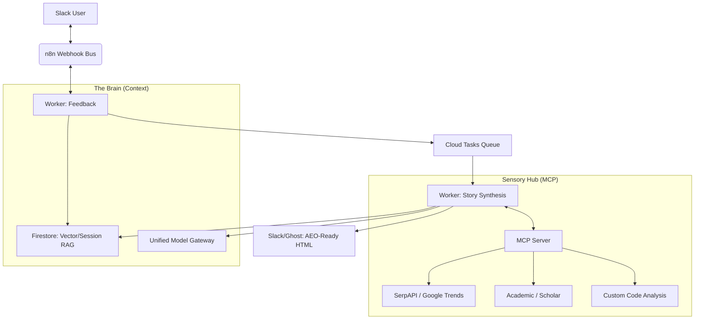

# 'Sonnet & Prose' — The Autonomous Content Strategist

**Sonnet & Prose** is a production-grade, multi-agent AI system designed for **Answer Engine Optimization (AEO)** and strategic content synthesis. It transforms complex inquiries into data-grounded narratives, research reports, and deep-dive articles optimized for both human clarity and LLM extraction.

---

## 1. The Strategy: Modular Intelligence
The system has evolved from a single script into a **decoupled multi-agent architecture**. It separates the "Hearing" (Intent Detection), "Refinement" (Human-in-the-loop), and "Scribe" (Synthesis) into specialized workers.

### Core Strategic Protocols
1.  **Simplicity Protocol**: A system-wide mandate to prioritize clarity. Complex technical concepts (HSM, PCI-DSS) are automatically grounded using plain-English analogies (Vaults, Fire Codes).
2.  **Meat-First Protocol**: Articles are architected to deliver high-density technical value or core findings in the opening paragraphs, satisfying "Zero-Click" search requirements.
3.  **Dynamic Word Budgeting**: The system semantically extracts target lengths (e.g., "1500 words") and uses an **Architect-Scribe** recursive pattern to strategically distribute word counts across sections.
4.  **Contextual Root Cause Analysis**: Synthesis doesn't just describe a problem; it analyzes systemic factors and regulatory anchors (e.g., NDPA, POPIA) found in the research context.

---

## 2. High-Level Architecture
The system utilizes a **Hub-and-Spoke** model built on Google Cloud Gen2 infrastructure and the Model Context Protocol (MCP).



---

## 3. System Modules

### worker-story
The primary synthesis engine. It handles **Deep Dives**, **pSEO Article Generation**, and **Topic Cluster Proposals**. It supports parallelized section drafting for high-speed delivery of long-form content.

### worker-feedback
The "Hearing" layer. It manages the Human-in-the-loop (HITL) cycle, allowing users to approve, refine, or repurpose drafts. It maintains context through a dedicated triage model that separates casual chat from strategic commands.

### mcp-server
The "Sensory Gateway." It decouples tool execution from orchestration. All external research, code analysis, and geo-aware trend detection are handled via the Model Context Protocol.

### eval-runner
Validation and benchmarking. It tests system logic against "Golden" responses to ensure zero regression in technical accuracy or pSEO formatting.

---

## 4. Deployment

### Prerequisites
- **GCP Service Account** with Firestore, Secret Manager, and Cloud Task permissions.
- **n8n** for Slack webhook management.
- **API Keys**: Anthropic (Sonnet 3.5/4.5), SerpAPI, Ghost Admin Key.

### Commands
```bash
# Deploy Sensory Hub
gcloud run deploy mcp-server --source ./mcp-server

# Deploy Feedback Triage
gcloud functions deploy process-feedback-logic --gen2 --source ./worker-feedback

# Deploy Synthesis Engine
gcloud functions deploy process-story-logic --gen2 --source ./worker-story
```

---

## 5. Key Use Cases
1.  **pSEO Synthesis**: Repurpose existing drafts or code snippets into Ghost CMS-ready HTML articles.
2.  **Comparative Regional Trends**: Query multiple markets (Lagos vs. Nairobi) simultaneously with ISO-enforced grounding.
3.  **Human-in-the-loop Editing**: Refine a 2000-word outline via Slack before the Scribe begins the draft.
4.  **Technical-to-Regulatory Mapping**: Automatically link technical features to compliance frameworks like NDPA/POPIA.

---
*Note: This project is ADK-compliant and follows a strict Zero-Markdown leakage policy for web publishing.*
