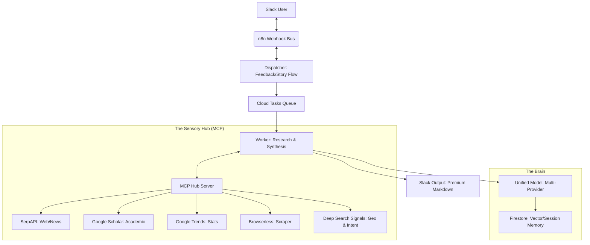

# 'Sonnet & Prose' — The Autonomous Content Strategist 🎭🌐

**Sonnet & Prose** is a production-grade, multi-agent AI system designed for **Answer Engine Optimization (AEO)** and strategic content synthesis. It transforms simple user inquiries into rich, data-grounded narratives, research reports, and deep-dive articles.

Built as an **ADK-Compliant** modular architecture, it leverages a centralized "Sensory Hub" via the **Model Context Protocol (MCP)** to provide specialized, high-fidelity research capabilities.

---

## 🚀 1. The Strategy: From "SEO" to "AEO"
In a world of Answer Engines (Perplexity, SearchGPT, Gemini), standard SEO isn't enough. **Sonnet & Prose** is built to win the "Zero-Click" SERP. It doesn't just write; it architecturally designs content to satisfy both human curiosity and AI grounding requirements.

### The Value Loop
1.  **Conversational Triage (Hearing Restoration)**: Distinguishes between casual banter, discovery research, and recursive drafting by analyzing raw user intent in context.
2.  **Centralized Sensory Hub (MCP)**: Separates "Sensory Tools" from "Orchestration Logic." A dedicated Hub handles multi-region searches, web scraping, and RAG retrieval.
3.  **Multi-Region Intelligence**: Automatically detects and searches across multiple geographic locations simultaneously for comparative research.
4.  **Action-Oriented Deliverables**: Detects intent for specialized formats like **Timelines** and **Comparison Tables**, delivering them immediately in a structured AEO-ready format.
5.  **Long-Term Memory (Hippocampus)**: Ingests every interaction into a vectorized knowledge base (Firestore RAG) to ensure the agent maintains cross-thread continuity.

---

## 🏗️ 2. High-Level Architecture
The system follows a modular "Hub-and-Spoke" architecture built on **Google Cloud Functions (2nd Gen)** and **Cloud Run**.



---

## 🧠 3. Advanced Agentic Features

### 📡 MCP-Modular Sensory Hub
Instead of hardcoding APIs into the worker, all "sensory" capability is centralized in the MCP Server:
- **detect_geo**: Identifies ISO country codes for up to 3 regions simultaneously, minimizing "Default US" bias.
- **detect_intent**: Identifies requested deliverables (Direct Answer vs. Timeline vs. Table) for automated formatting.
- **Unified Proxy**: All research tools (Web, Trends, Scholar, Images) are unified under a single MCP interface.

### 🏛️ Recursive Expansion (Deep Dives)
To solve the "One-Shot Trap," the system implements a **Recursive Workflow**:
- **Dynamic Word Count**: Extracts targets (e.g., "800 words") directly from prompts.
- **Architectural Blueprinting**: Designs a multi-section structure before writing a single word.
- **Context Stitching**: Seamlessly links sections together using "tail-end" context from previous chapters.

### 🎭 Refined "Sonnet & Prose" Persona
- **Strategic Synthesis**: Connects external trends with internal RAG memory.
- **Natural Language**: Prohibits robotic structural labels (e.g., "H2 - Intro"). Structure is implied through natural headers and bolding.
- **AEO-First**: Utilizes "Inverted Pyramid" leads and modular headers to ensure content is optimized for snippets and LLM extraction.

---

## 🛠️ 4. Setup & Deployment

### Prerequisites
- **Google Cloud Platform** (Firestore, Secret Manager, Cloud Run)
- **n8n** (Webhook orchestration)
- **Slack App** (Bot Token, Events API)
- **API Keys**: SerpAPI, OpenAI/Anthropic (Optional), Search Engine ID (CSE).

### 1. Deploy the MCP Hub (Cloud Run)
```bash
gcloud run deploy mcp-server --source . --no-allow-unauthenticated
```

### 2. Deploy the Story Worker (Cloud Functions)
```bash
gcloud functions deploy process-story-logic \
     --gen2 --region=$LOCATION --source=. \
     --entry-point=process_story_logic \
     --runtime=python312 \
     --timeout=540s \
     --set-env-vars MCP_SERVER_URL=[YOUR_CLOUD_RUN_URL]
```

---

## 📖 5. How to Use
1.  **Multi-Region Trends**: `"Compare tech adoption trends in Nigeria versus Kenya."` (Signals detected: `NG, KE`).
2.  **Structured Timeline**: `"Create a timeline of AI developments in 2024."` (Deliverable detected: `TIMELINE`).
3.  **Long-Form Article**: `"Write an 800-word deep-dive on [Topic] for my Ghost CMS."`
4.  **Conversational Banter**: `"Hey, how are you today?"` (Intent detected: `SOCIAL` - zero research cost).

---

