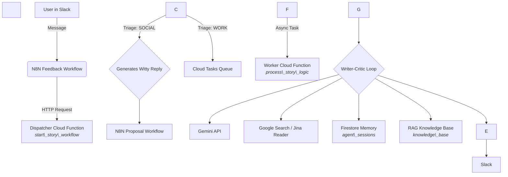

The "Then & Now" Agent: An Autonomous Content Strategist
A Capstone Project for the 5-Day AI Agents Intensive Course with Google

1. The Pitch

Title: The "Then & Now" Agent: An Autonomous Content Strategist
Subtitle: A multi-agent system that uses iterative refinement and RAG to transform simple topics into strategic, thought-leadership narratives.

The Problem
In the fast-evolving tech landscape, content teams struggle to keep up. Manually researching a new concept (like AEO vs. SEO), analyzing its historical context, and drafting a strategic narrative takes days. This bottleneck prevents businesses from establishing thought leadership on emerging trends and answering complex user questions with depth and nuance.

The Solution
This project is an autonomous agent that acts as a lead Research Analyst and Content Strategist. When given a topic or question via Slack, it uses a multi-agent system to:

1. Triage & Understand: Semantically classify user intent to distinguish between casual conversation and a work request.
2. Research & Read: Use Google Search and a URL reader tool to gather real-time, external context, including its own long-term memory (RAG).
3. Synthesize & Refine: Employ an internal 'Writer-Critic' loop to iteratively draft and refine a strategic 'Then vs. Now' analysis, ensuring high quality before human review.
4. Collaborate: Present the refined proposal or direct answer to a human via Slack for a final, conversational approval loop (HITL).
5. Produce & Learn: Upon approval, generate the final story, create a Google Doc artifact (via N8N), and ingest the new knowledge into its long-term memory in Firestore.

The Value
This agent transforms a multi-day research and drafting process into a 5-minute, near-autonomous workflow. It allows a single strategist to produce high-quality, data-grounded thought leadership at scale, enabling businesses to react to market shifts in near real-time. It's not just a writer; it's a strategic partner that can answer questions, draft proposals, and learn over time.

---

2. Architecture

This agent is built on a serverless, event-driven microservice architecture to ensure scalability and cost-effectiveness. The core logic resides in Google Cloud, with N8N acting as the "last mile" automation bus for Slack and Google Docs integration.

\*   \*\*Slack -> N8N -> Dispatcher:\*\* Handles initial triage (Social vs. Work).

\*   \*\*Dispatcher -> Cloud Task -> Worker:\*\* The core async pattern to prevent timeouts.

\*   \*\*Worker:\*\* Orchestrates the research, Writer-Critic loop, and final HITL proposal generation.

\*   \*\*Feedback Loop:\*\* A separate N8N workflow listens for replies, calling the `handle\_feedback\_workflow` dispatcher, which in turn uses a worker to process refinements, approvals, or context switches.

---

Key Architecture Components:
- Slack -> N8N -> Dispatcher: Handles initial triage (Social vs. Work).
- Dispatcher -> Cloud Task -> Worker: The core async pattern to prevent timeouts.
- Worker: Orchestrates the research, Writer-Critic loop, and final HITL proposal generation.
- Feedback Loop: A separate N8N workflow listens for replies, calling the handle_feedback_workflow dispatcher, which in turn uses a worker to process refinements, approvals, or context switches.

---

3. Key ADK Features Implemented

This project demonstrates a sophisticated application of five core ADK concepts:

Multi-agent System:
- LLM Orchestrator: The process_story_logic and process_feedback_logic functions act as orchestrators, making decisions and calling tools.
- Loop agents: The "Writer-Critic" while loop is a direct implementation of this pattern for quality refinement.
- Sequential agents: The overall workflow (Research -> Loop -> HITL -> Finalize) is a sequential pipeline.

Tools:
- Custom tools: Built several Python functions for specific tasks (find_trending_keywords, create_euphemistic_links, critique_proposal, refine_proposal).
- Built-in tools: Integrated Google Search.
- External Tools: Integrated Jina Reader, N8N, Slack, and Google Docs, demonstrating complex, real-world interoperability.

Long-running operations (pause/resume agents):
- The core HITL workflow is an LRO. The agent pauses by saving state to Firestore (logging an adk_request_confirmation event) and sending a webhook. It resumes when the handle_feedback_workflow receives the human's approval, loads the state from memory, and continues.

Sessions & Memory:
- Sessions & state management: A session_id tracks every conversation. Agent state (status, topic, event_log) is explicitly serialized into Firestore, which acts as our persistent SessionService.
- Long term memory (RAG): The knowledge_base collection and the ingest-knowledge function are a direct implementation of RAG for the agent's long-term memory.
- Context engineering: The event_log serves as a rich context window for the agent to understand conversational history, enabling advanced features like "Session Graduation" (Social -> Work) and "Context Downgrade" (Proposal -> Question).

Agent deployment (Bonus):
- The system is deployed as a multi-function microservice architecture on Google Cloud Functions (2nd Gen), built on Cloud Run. The repository includes a clear, repeatable deployment process using PowerShell scripts.

---

4. Setup & Deployment

Prerequisites
- Google Cloud SDK (gcloud CLI) installed and authenticated.
- Python 3.12+ installed.
- A self-hosted N8N instance.
- A Slack App with Bot Token permissions.

GCP Setup
1. Create a new GCP Project.
2. Enable the following APIs: Cloud Functions, Cloud Run, Cloud Build, Cloud Tasks, Firestore, Secret Manager, Vertex AI, Custom Search API.
3. Create a Service Account (e.g., aeo-devops-agent-identity) and grant it the following IAM roles:
   - Cloud Tasks Enqueuer
   - Cloud Run Invoker
   - Secret Manager Secret Accessor
   - Vertex AI User
   - Cloud Datastore User
   - Service Account User
4. Create a Firestore database in Native Mode.
5. Create a Cloud Task queue (e.g., story-worker-queue).
6. Create secrets in Secret Manager for google-search-api-key and browserless-api-key.

Local Setup
1. git clone https://github.com/cephasoo/google-adk-aeo-v2
2. cd google-adk-aeo
3. python -m venv venv
4. .\venv\Scripts\Activate.ps1
5. pip install -r requirements.txt

Deployment
1. Open PowerShell and run the "Pre-Flight Checklist" to set your environment variables ($project_id, $search_id, $N8N_PROPOSAL_WEBHOOK_URL).
2. Execute the gcloud functions deploy commands for the four functions: start-story-workflow, handle-feedback-workflow, process-story-logic, and process-feedback-logic. *Full commands are available in the project documentation or can be provided upon request.*

---

5. How to Use

1. Invite the Slack Bot to a channel.
2. Send it a message.
   - For a conversational reply: "Hello!"
   - To get a direct answer: "What is the history of the telephone?"
   - To trigger the "Then vs Now" proposal workflow: "Draft a story about the evolution of video games."
3. Interact with the agent by replying in the thread to refine, approve, or ask follow-up questions.